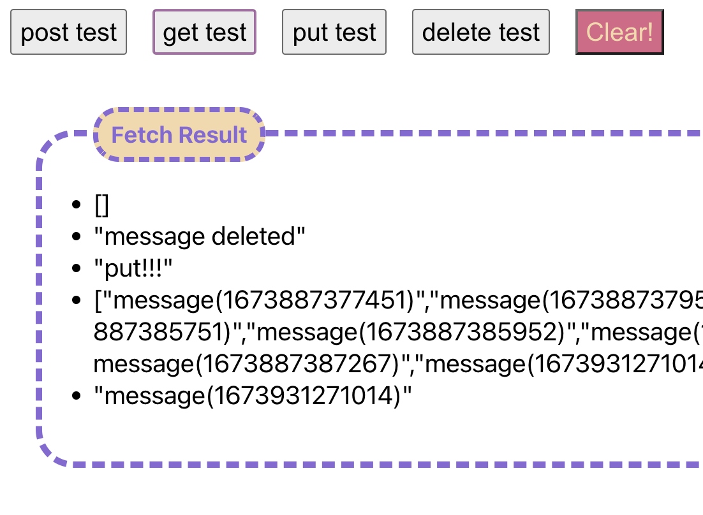
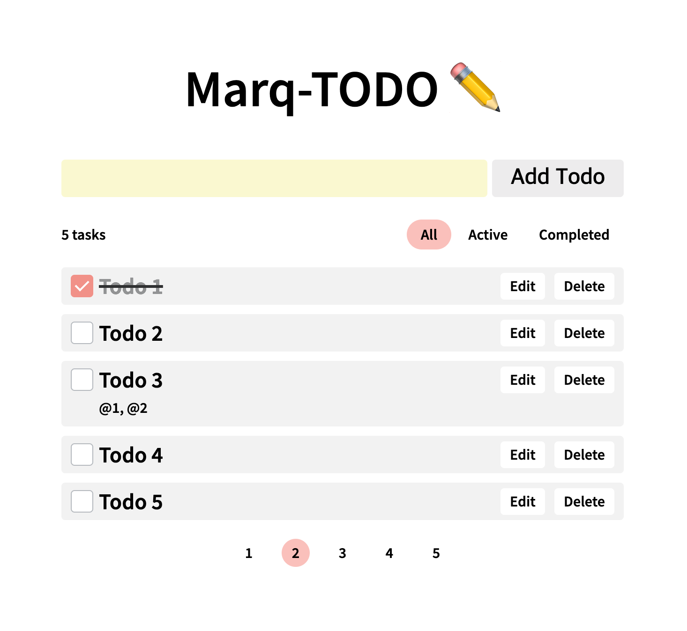

## 프로젝트 구성

-   사용자는 문자열로 된 todo를 추가 할 수 있다.
-   작성일, 최종수정일, 내용, 참조하고 있는 todo들의 id가 표시된다.
-   사용자는 todo를 완료 또는 미완료로 상태변경을 할 수 있다.
-   todo는 다른 todo들을 참조할 수 있다.
-   참조하고 있는 todo들이 모두 완료 상태가 아니라면 todo를 완료할 수 없다.
-   사용자는 todo 목록을 조회할 수 있다.
-   사용자는 todo를 수정할 수 있다.
-   사용자는 todo를 삭제할 수 있다.
-   페이지네이션!
-   프로젝트-root/src/mocks/handlers.ts 에 mock api를 구현하고 todo 앱이 해당 api를 통해서 작동.

## 구현 예시 이미지

-   todo 1은 완료 상태이다.
-   todo 3은 todo 1, 2를 참조하고 있다.
-   todo 3은 todo 1, 2가 완료되기 전에는 완료되면 안 됨.
